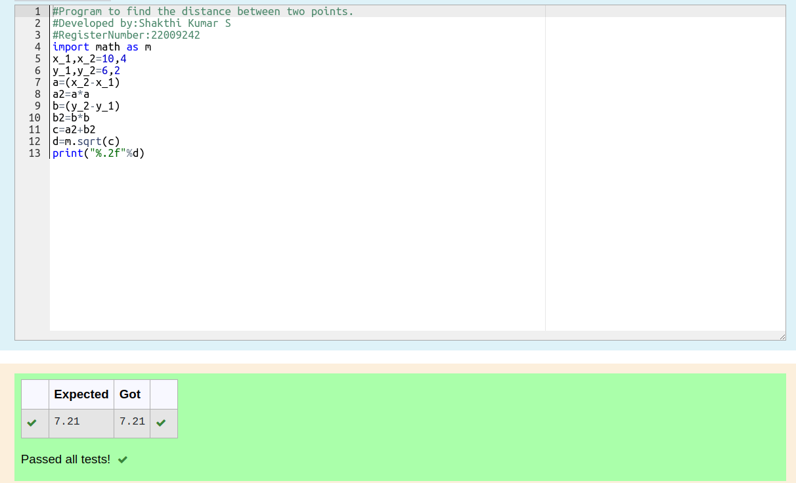

# DISTANCE-BETWEEN-TWO-POINTS

## AIM:
To write a python program to find the distance two 2 points

## ALGORITHM:
### Step 1:
Import math
### Step 2:
Give the input of two points and find the distance between them using the formula
### Step 3:
Substitute the values in the distance formula  
### Step 4:
Print the distance between the two points
### Step 5:
End the program

### PROGRAM:
```python
#Program to find the distance between two points.
#Developed by:Shakthi Kumar S
#RegisterNumber:22009242
import math as m
x_1,x_2=10,4
y_1,y_2=6,2
a=(x_2-x_1)
a2=a*a
b=(y_2-y_1)
b2=b*b
c=a2+b2
d=m.sqrt(c)
print("%.2f"%d)
```

### OUTPUT:


### RESULT:
Thus the distance of two points is successfully executed and diplayed.
